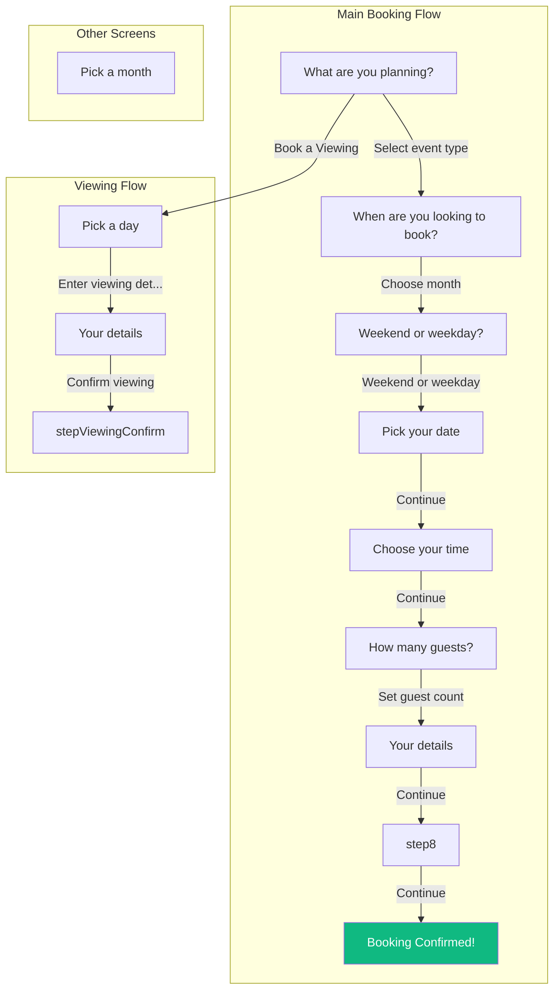
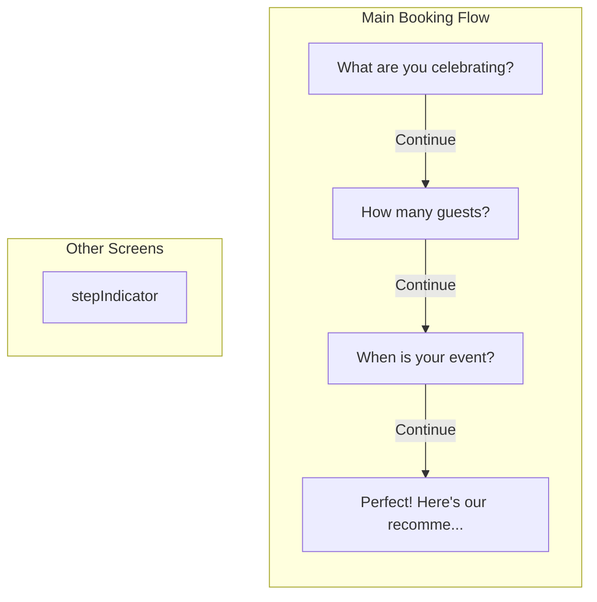
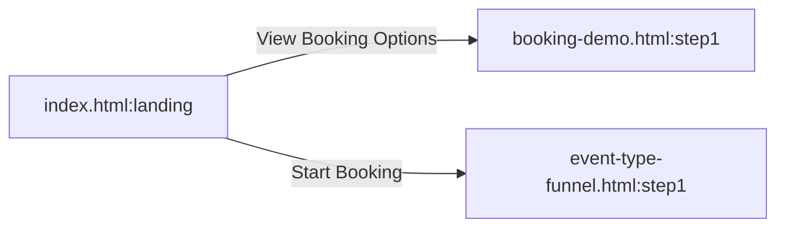

# HB Studio Booking Funnel Flow

_Generated: 28 Jan 2026_

## Main Booking Flow



### Screen Details

| Screen ID | Title | Elements | Transitions |
|-----------|-------|----------|-------------|
| `step1` | What are you planning? | 4 choice-card | → step2, → stepViewing |
| `step2` | When are you looking to book? | 3 choice-card, 1 button | → step3 |
| `stepMonthPicker` | Pick a month | 3 button | - |
| `step3` | Weekend or weekday? | 2 choice-card, 1 button | → step4 |
| `step4` | Pick your date | 1 button | → step5 |
| `step5` | Choose your time | 5 button, 4 time-slot | → step6 |
| `step6` | How many guests? | 1 button, 4 guest-btn | → step7 |
| `step7` | Your details | 3 button, 3 input, 3 form-group | → step8 |
| `step8` | step8 | 2 button, 6 summary | → step9 |
| `step9` | Booking Confirmed! | 1 button, 5 summary | - |
| `stepViewing` | Pick a day | 1 button | → stepViewingDetails |
| `stepViewingDetails` | Your details | 3 button, 3 input, 3 form-group | → stepViewingConfirm |
| `stepViewingConfirm` | stepViewingConfirm | 1 button, 4 summary | - |

## Event Type Funnel



### Screen Details

| Screen ID | Title | Elements | Transitions |
|-----------|-------|----------|-------------|
| `stepIndicator` | stepIndicator | - | - |
| `step1` | What are you celebrating? | 6 button | → step2 |
| `step2` | How many guests? | 2 button, 1 input | → step3 |
| `step3` | When is your event? | 2 button, 2 input | → step4 |
| `step4` | Perfect! Here's our recommendation: | 2 button | - |

## Landing Page

```mermaid
flowchart TD

    %% Transitions
```

### Screen Details

| Screen ID | Title | Elements | Transitions |
|-----------|-------|----------|-------------|

## Cross-Flow Navigation


