# 🚀 Gas Turbines Lagos – Knowledge Hub  

> Last updated: 2025-06-11  

## 🔹 Overview  
The **Gas Turbines Lagos** initiative aims to monetise Nigerian industrial-power pain points by supplying reliable gas-turbine power solutions.  The strategy has recently pivoted away from **cold-email lead-gen** towards **phone-first outreach**, fuelled by large-scale Claude "deep research".  

## 🔹 Current Objective  
Deliver **50 verified decision-maker phone numbers per week** for high-power-spend Nigerian manufacturers and facilities, enabling rapid cold-calling and solution qualification.  

## 🔹 Key Decisions ✓  
1. **Phone-first outreach** – Email remains secondary; success metric is call connection rate.  
2. **Claude Opus as discovery engine** – Use 500-source deep search to surface relevant pages & numbers, negating the need for Firecrawl.  
3. **Legacy MCP email stack deprecated** – Scripts in `lead_gen_system/tools/scripts/` retained for reference only.  

## 🔹 Working Pipeline (v2)  

```mermaid
graph TD
  A[Claude Deep Research – identify companies & data sources] --> B[Data Harvest – scrape public docs, CAC filings, tender PDFs]
  B --> C[Enrichment APIs / Desk-Research – Apollo, PDL, LinkedIn clues]
  C --> D[Validation – Numverify / WhatsApp Lookup]
  D --> E[VA Spot-Check 5%]
  E --> F[Deliver CSV + Optional WhatsApp Intro]
```

• **Automated**: Steps A–D (scripts + APIs)  
• **Human QA**: Step E (Virtual assistant)  
• **Deliverable**: Step F – `leads_pack.csv`, confidence scores, Loom walk-through.  

## 🔹 Data Assets  
| Asset | Path | Status |
|-------|------|--------|
| Original company lists | `Database/ACTIVE_LEADS/*` | Imported & deduped → `companies_master.csv` |
| ROI calculator | `lead_gen_system/tools/power_roi_calculator.html` | Valid & referenced |
| SpecStory logs | `knowledge-archaeology/inputs/conversations/GAS/*` | Source of decisions & context |

## 🔹 Pending Explorations ~  
- **Geographical targeting** – Scrape phone data by high-density roads / estate clusters.  
- **Number-only data sources** – Investigate CAC filings, tender PDFs, supplier directories.  

## 🔹 Open Questions ?  
1. Best API / regex strategy to reduce false-positives in 🇳🇬 number formats.  
2. Optimal VA workflow vs automated WhatsApp ping for validation.  
3. Pricing model per verified lead pack.  

## 🔹 Contributing  
1. Clone repository & activate virtual-env.  
2. Run `python pipeline/demo.py --sample` to test extraction flow (TBD).  
3. Submit PRs with concise commits; tag issues using `Decision`, `Consideration`, or `Conflict`.  

## 🔹 Next 7-Day Sprint  
| Day | Goal |
|-----|------|
| 1-2 | Craft & test Claude prompt for URL + number extraction |
| 3   | Implement regex + Numverify validation script |
| 4   | WhatsApp API proof-of-concept |
| 5   | VA pilot on 20 numbers |
| 6-7 | Build first `leads_pack.csv`, measure <30 % connection threshold |

---
*README auto-generated by knowledge-archaeology pipeline.* 🤖 