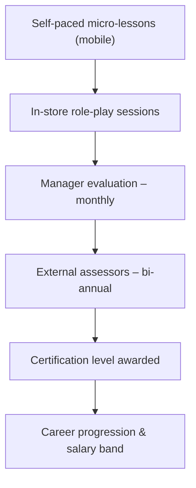

# 🛍️ FORJE Retail Certification – Knowledge Hub  

> Last updated: 2025-06-12  

## 🔹 Overview  
The **FORJE Retail Certification** initiative is building **Nigeria's first professional, transferable qualification system** for frontline retail staff.  Mobile-first learning modules (5-10 min) are paired with monthly manager-led role-plays and bi-annual external assessments.  Outcome → uplift in conversion, basket metrics and career pathways.  

## 🔹 Current Objective  
Secure a **pilot retailer** (5-20 store fashion / lifestyle chain) and validate the v1 certification loop (Level 1–3).  Deliver measurable behavioural change and at least **+10 % uplift** in the chosen sales KPI within 6 months.  

## 🔹 Key Decisions ✓  
1. **Pilot partner open** – LBS Fashion programme proposal logged but not mandatory. Sourcing alternate chains.  
2. **Landing page rebuild** – New marketing site will replace legacy Netlify prototype.  
3. **Training archive v002 is draft** – Final asset pack still in production.  

## 🔹 Working Model (draft)  

• **Manager vs External weight:** *30 % internal / 70 % external* – figure derived from **Abu interview** (65 managers, 275 staff ⇒ ~2 h/month review capacity). Pending final confirmation.  

## 🔹 Interview Insights  
| Interviewee | Role / Company | Key Takeaways |
|-------------|---------------|---------------|
| Ijeoma (Adidas franchise) | Retail HR / Ops Lead | Customer service & product knowledge gaps; emphasised enthusiasm, structured sales script; conversion rate as primary KPI; supports hybrid evaluation + strict consequences; budgets ~40h training pp/yr |
| Abu (Smartmark) | Store Owner / Manager | Needs sales flow structure & positivity; 50% manager confidence; advocated hybrid eval 50/50; capacity numbers 275 staff / 65 mgrs; likes Retail Routine App + QR feedback |
| Kieran Murphy | Ex-Luxury Retail Manager | Staff struggle with price objection & cross-sell; mobile micro-lessons ideal; certification seen as hiring advantage |
| Uzomaka (Ash Luxury) | Boutique Owner | Wants transferable credentials but fears poaching; prioritises basket-size uplift |
| Ifeoma (Adidas HQ) | Training Coordinator | Managers need better evaluation training; supports external audits; retention improves with clear career ladder |
| Sales-Staff Part 1/2 | Frontline Associates | Prefer <10 min videos; role-plays help confidence; seek recognition & rewards |

## 🔹 Data Assets  
| Asset | Path | Status |
|-------|------|--------|
| Strategy README | `01-CORE/README.md` | Approved |
| Prototype landing | `01-CORE/Netlify/forje-mvp-landing.html` | Legacy |
| Brand prospectus | `04-ASSETS/forje-brand-prospectus/*` | Final |
| Interview transcripts | `02-RESEARCH/INTERVIEWS/*` | Analysed |
| Partnership proposal | `03-PARTNERSHIPS/forje-lbs-proposal/*` | Submitted (Dec 2024) |

## 🔹 Pending Explorations ~  
- Select primary KPI: Conversion vs Basket Size vs Basket Items.  
- Decide certification scope: Internal-only vs Industry-wide transferable.  
- Flesh out incentive scheme (bond, pay-band progression).  
- Competitor landscape mapping (Nigerian retail training).  

## 🔹 Open Questions ?  
1. Final pilot candidate and timeline?  
2. What split of manager/external evaluation is operationally viable?  
3. What exact success targets (numbers) define pilot win?  
4. Need perspectives from cashiers / VM roles?  

## 🔹 Contributing  
1. Place new research docs under `02-RESEARCH/` with clear prefixes.  
2. Update `retail_ambiguities.md` when decisions are made.  
3. Run `python3 scripts/retail_scan.py` after significant file changes to refresh the profile/map.  

---  
*README auto-generated by knowledge-archaeology pipeline.* 🤖 