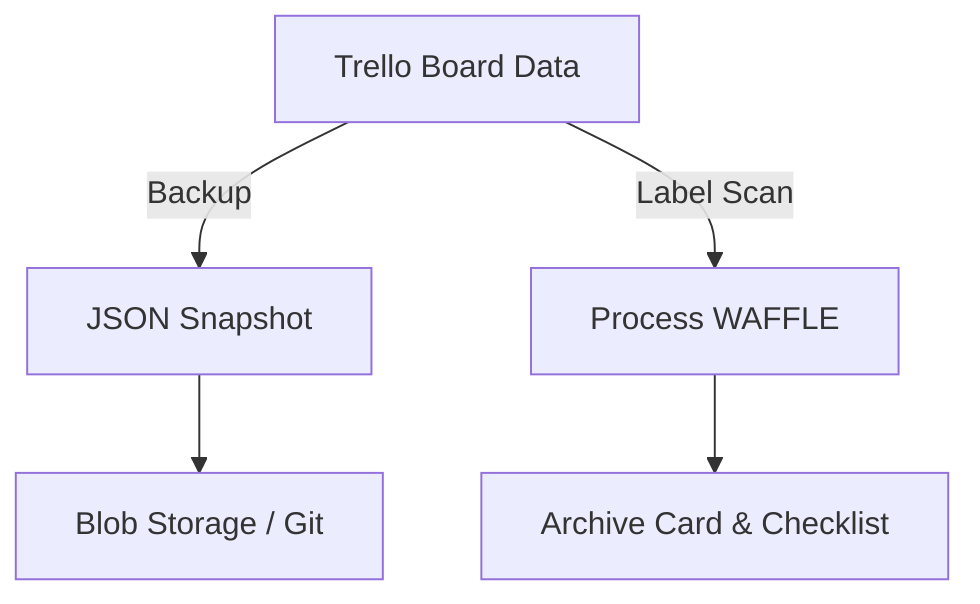

# 📋 Trello MCP – Knowledge Hub

> Last updated: 2025-06-12

## 🔹 Overview
The **Trello MCP** project provides a set of server-side tools (Python + JS) that expose powerful Trello automations through the **MCP tool interface**.  Capabilities include board backups, label processors (WAFFLE → WAFFLE ARCHIVED), checklist utilities and Gmail/Trello bridge scripts.

## 🔹 Current Objective
Stabilise core automation scripts and ship **nightly Trello board backups** + **WAFFLE label archival flow** for production boards.

## 🔹 Key Decisions ✓
1. **MCP-native tools** instead of ad-hoc CLI scripts – simplifies integration with agents and CI.
2. **Board-level OAuth tokens** stored in `credentials/` – avoids user password flows.
3. **JSON backups in /data** – human-readable & diff-friendly.

## 🔹 Automation Pipeline (draft)

## 🔹 Data Assets
| Asset | Path | Status |
|-------|------|--------|
| MCP Trello tools | `src/tools` | In progress |
| Backup dumps | `data/` | Growing |
| Test suite | `tests/` | Partial |

## 🔹 Pending Explorations ~
- Webhook-driven real-time processing vs cron schedule.
- Fine-grained retry logic for rate-limited requests.

## 🔹 Open Questions ?
1. Backup retention & purge strategy?
2. How to support multi-workspace boards securely?

## 🔹 Contributing
1. Clone repo & install deps (`npm i && pip install -r requirements.txt`).
2. Run `python3 scripts/trello_mcp_scan.py` after major file changes to refresh this hub.
3. Submit PRs with concise commits; tag issues as `Decision`, `Question`, `Enhancement`.

---
*README auto-generated by knowledge-archaeology pipeline.* 🤖