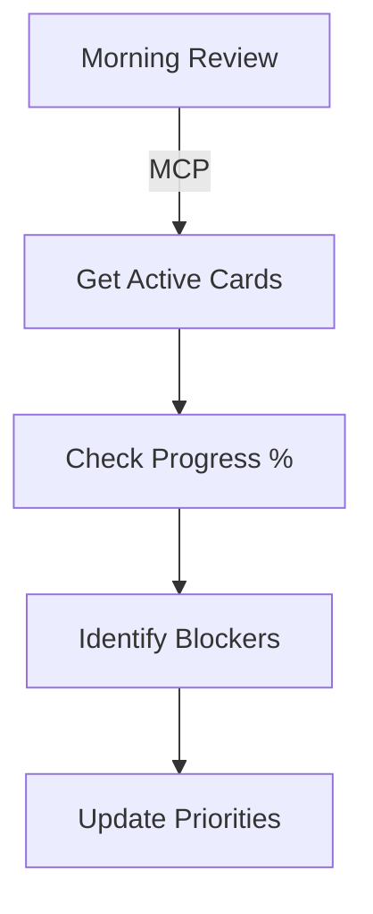
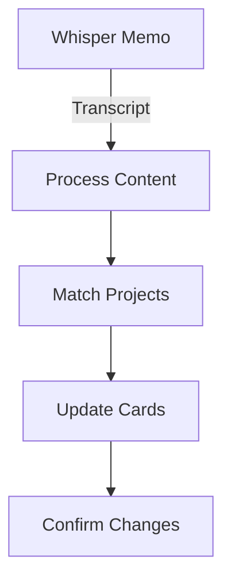
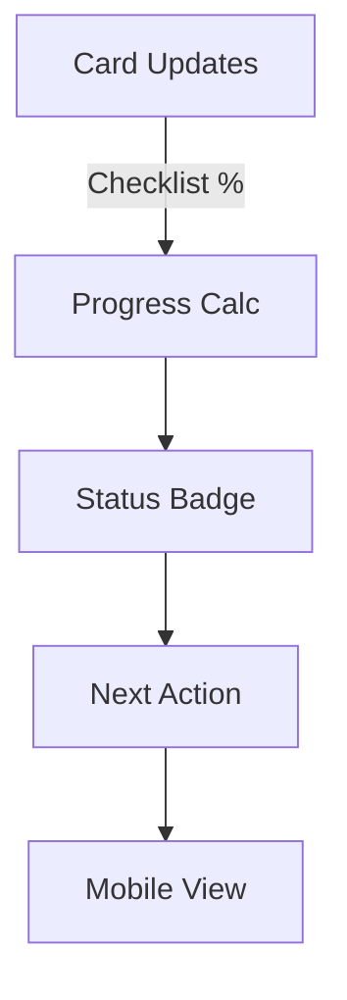

# 📋 Trello MCP – Project & Automation Hub

> Last updated: 2025-06-13

## 🔹 Overview
The **Trello MCP** project provides a unified interface for managing both **powerful Trello automations** and **active project tracking** through MCP server endpoints. This hub surfaces what's available, what's in progress, and what's next—all accessible on mobile.

## 🔹 Current Objective
Maintain visibility across all active projects and automations, ensuring each has clear status, triggers, outputs, and success metrics for easy mobile review and action.

---

## 🤖 Available Automations

### 🔄 Board Management
| Tool | Status | Trigger | Output | Success Metric |
|------|--------|---------|--------|----------------|
| **Board Backup** | ✅ Stable | Manual/Scheduled | JSON snapshots in `/data` | Daily backups exist |
| **WAFFLE Processing** | ✅ Stable | Manual | Archived cards + summaries | Cards moved to archive |
| **Checklist CRUD** | ✅ Stable | Manual | Updated checklists | Items created/updated |

### 📱 Integration Tools
| Tool | Status | Trigger | Output | Success Metric |
|------|--------|---------|--------|----------------|
| **Gmail Bridge** | 🔧 In Progress | Manual | Email notifications | Messages sent |
| **Transcript Processing** | 🔧 In Progress | Voice upload | Structured updates | Auto-dissemination works |
| **Card Linking** | ✅ Stable | Manual | Cross-references | Links created |

---

## 🚀 Active Projects

### 🔥 Active Projects (5 cards)
| Project | Status | Progress | Next Action | Attachments |
|---------|--------|----------|-------------|-------------|
| **🔥 Nigerian Gas Power** | Phone-ready | 19/42 ✓ | Make first calls | [Strategy docs](https://trello.com/c/sKWs7VDW) |
| **🚀 FORJE Retail Training** | Live site | 15/24 ✓ | Schedule interviews | [Landing page](https://trello.com/c/a7jv33yx) |
| **⚡ Trello MCP** | Ongoing dev | 0/9 ✓ | Feature expansion | [Dev context](https://trello.com/c/xztTYMCd) |
| **🤖 Auto-Dissemination** | Phase 1 MVP | 0/10 ✓ | Build core tool | [PRD docs](https://trello.com/c/vcBrZtqy) |
| **🌺 HB** | New | No checklists | Define scope | [Card](https://trello.com/c/Y2KBfjVm) |

### 📅 Upcoming Priorities (6 cards)
| Project | Due Date | Status | Quick Action |
|---------|----------|--------|--------------|
| **💼 Monday Work Meeting** | Next Monday | 0/4 ✓ | Prep BI updates |
| **🎂 Dad's 60th Birthday** | July 27th | 0/3 ✓ | Start planning |
| **💒 Munaj Wedding** | July | 0/4 ✓ | Coordinate logistics |
| **🏥 World Health Expo** | Tomorrow | 1/6 ✓ | Invite Buki |
| **🚧 Vehicle Vault** | Ongoing | No checklists | Fix database |
| **👕 Grandma Timi Clothes** | June 14th | No checklists | Sunday pickup |

---

## 🔹 Automation Pipeline Workflows

### 1. **Daily Board Sync**

### 2. **Voice-to-Action Flow**

### 3. **Project Status Tracking**

---

## 🔹 Success Metrics

### Automation Health
- **Board Backups:** Daily JSON snapshots exist ✅
- **WAFFLE Processing:** Cards archived within 24h ✅
- **Checklist Updates:** Real-time sync working ✅

### Project Visibility
- **Progress Tracking:** Checklist completion % visible ✅
- **Next Actions:** Clear for each active project ✅
- **Mobile Access:** All cards accessible via links ✅

### Workflow Efficiency
- **Voice Processing:** 80% time saving target (30min → 6min)
- **Project Updates:** Auto-dissemination accuracy >90%
- **Daily Usage:** Hub checked within 1 week

---

## 🔹 Quick Actions

### For Automations
- **Backup Board:** `backup_trello_board` tool
- **Process WAFFLE:** `process_waffle_cards` tool
- **Add Checklist:** `add_checklist_to_card` tool

### For Projects
- **Check Progress:** Review checklist completion %
- **Update Status:** Add checklist items or notes
- **Link Cards:** Use cross-references for related work

---

## 🔹 File Attachments

| Category | Files | Mobile Access |
|----------|-------|---------------|
| **Profiles** | [trello-mcp.json](mdc:knowledge-archaeology/outputs/TrelloMCP/trello-mcp.json) | ✅ |
| **Concepts** | [trello_mcp_profile_concept.json](mdc:knowledge-archaeology/outputs/TrelloMCP/trello_mcp_profile_concept.json) | ✅ |
| **Questions** | [trello_mcp_ambiguities.md](mdc:knowledge-archaeology/outputs/TrelloMCP/trello_mcp_ambiguities.md) | ✅ |

---

## 🔹 Contributing
1. **Update Projects:** Add checklists to track progress
2. **Refresh Hub:** Run `python3 scripts/trello_mcp_scan.py` after changes
3. **Add Automations:** Document trigger, output, success metric

---
*Hub auto-generated by knowledge-archaeology pipeline.* 🤖