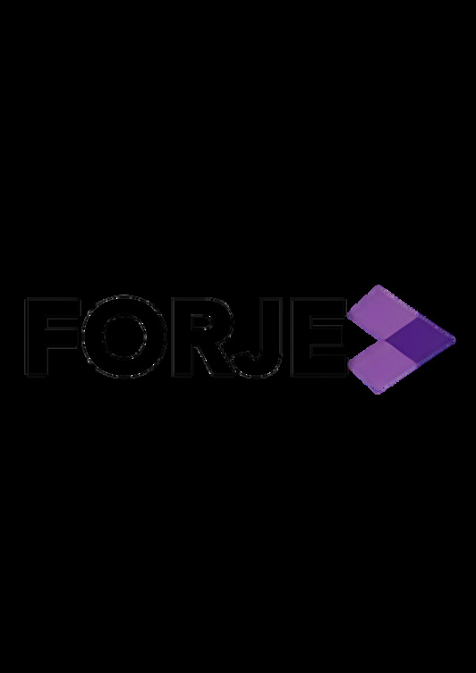

# Page 1

Changing the retail
landscape in West Africa
Partnership
Prospectus

# Page 2

Retail Diagnostics &
Strategy 
Retail Academy
Performance
Coaching and KPI
tracking.
Talent Sourcing
Process Optimisation
1
FORJE is a Lagos-headquartered retail-performance firm built to close
the service-quality gap in West Africa’s fast-growing consumer
economy. Founded in 2025 by Timilehin Tikolo—former CCO &
Supply Chain Head at Ashcorp Group—our team blends more than
four decades of fashion, luxury, hospitality and technology experience
into a single, end-to-end platform.
About FORJE

# Page 3

2
Mission
To elevate customer experience and operational excellence across
Africa’s consumer-facing industries by providing data-driven
consulting, world-class training, and end-to-end talent solutions that
turn retail potential into measurable profit.
Vision
To set the standard for outstanding retail and hospitality service across
West Africa.
Mission &
Vision

# Page 4

3
Operational Pillars
We operate on two tightly linked pillars:
Core
Growth
Academy
A strategy-consulting practice
that fixes assortment, buying,
merchandising, business
development, commercial
planning, performance and
supply-chain pain points
Overview
Consulting
Retail Academy that recruits,
trains, certifies and coaches
frontline and head-office talent
Overview

# Page 5

Why Nigeria &
West Africa
4
465 million youthful consumers (West Africa), double-digit retail growth, and a critical skills gap. 
1
2
Retail already contributes ~16 %
of Nigeria’s GDP yet 6 in 10
graduates lack job-ready
service skills (Jobberman,
2025).
Front-line turnover exceeds 30 %
annually; recruiters and brands
cite poor selling skills and weak
merchandising practices as top
barriers to growth.
Talent & Skills Gap
Operational Challenges
3
4
Talent Pool
Evaluation & Optimization
International brands (Tommy
Hilfiger, Lacoste, NIKE) and local
chains are scaling fast but cannot
find globally-ready talent in-
market.
Africa’s largest consumer base:
Nigeria’s population is ~237 million
(2025) and will surpass 260 million
by 2030 , with a median age 18.1
years; almost two-thirds of
Nigerians are under 25. 
60%
% of Nigerians <25 Years Old
Massive entry-level pool

# Page 6

5
What we
need from
you
License your proven retail-academy IP, share
best practices and jointly take West Africa’s
fastest-growing consumer market.
Access to your core
modules (Retail Sales, CX
Excellence, Buying &
Merchandising, Inventory
Planning, Store
Leadership). 
Joint branding on
certificates, marketing
collateral, and public-
facing events. 
Share data and best
practices to continually
improve African service
standards.
Rights to localise case
studies, role-plays, and
assessments for West-
African context.
Shared thought-
leadership (white papers,
webinars) spotlighting
market insights.
Nigeria’s combination of scale, youth, and retail formalisation offers a once-in-a-generation
growth curve - but only if the industry can rapidly upskill its front-line and back-end talent.
This is the gap we can fill together.

# Page 7

Zero-capex Africa entry 
You add Nigeria & West Africa
coverage overnight—no legal
entity, offices or payroll.
Dual engine: Consulting
+ Academy
One partner to diagnose, train
and staff—simplifies your go-
to-market and keeps quality
consistent.
First-mover 
credibility
Be the first internationally
recognised retail academy on
the ground
Cultural localisation,
global standards
Your IP stays intact; we tailor
examples, legal frameworks
and role-plays so learners
connect instantly—yet
content still meets your
certification thresholds.
Built-in talent funnel
Graduates go straight into our
recruitment pipeline; we share
placement fees or feed them
back into L&D budgets—new
recurring revenue stream.
6
Why Partner with FORJE
Partnering with FORJE gives you instant scale, measurable ROI and first-mover status in Africa’s biggest
retail market—without the fixed costs or execution risk.

# Page 8

Let’s make West Africa a benchmark for world-class
retail and hospitality service.
7
Contact Us
234-908-328-2287
commercial@forje.org
21 Akanbi Disu, Lekki Phase 1, Lagos. 

