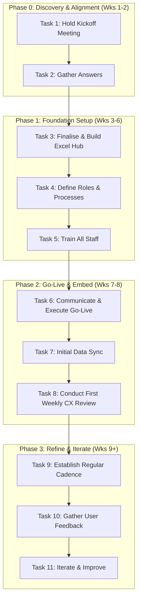
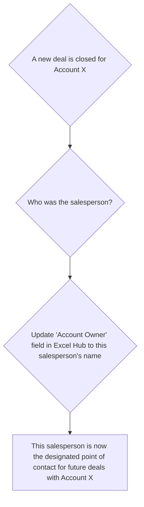

# Unified Customer Experience Strategy v11
## Mikano International Limited

---

## 🔹 Executive Summary

**The Goal**: A single, unified customer experience to boost satisfaction and revenue across all divisions.

**The Strategy**: This is a ground-up, manual-first plan focused on process discipline before expensive technology. We will build a simple, robust foundation using Excel, a tool we already control. The core principles are:
1.  **ERP is the King**: The ERP is the single source of truth for all financial data (customers, orders, inventory). Our system works with it, not against it.
2.  **Data-Driven Rules**: We will use data to solve operational problems like sales conflicts, removing ambiguity and emotion.
3.  **Pragmatic & Manual-First Tech**: We start with Excel because it is powerful, flexible, and has zero cost. We will define clear, data-driven triggers for when to consider investing in a formal CRM.

---

## 🔹 Phased Action Plan & "Plan on a Page"

### The Plan on a Page

### Action Plan Details

| Phase | Task # | Task Description | Key Deliverable(s) | Est. Timeline |
| :--- | :--- | :--- | :--- | :--- |
| **Phase 0** | 1 | Hold Kickoff Meeting | Presentation of this doc, verbal buy-in from stakeholders | Week 1 |
| **Phase 0** | 2 | Gather Initial Answers | Documented answers to the "Open Questions" section | Week 2 |
| **Phase 1** | 3 | Finalise & Build Excel Hub | The final, blank Excel file, saved on OneDrive | Week 3 |
| **Phase 1** | 4 | Define Data & Governance Roles | Names assigned to "Data Steward" and ERP export roles | Week 4 |
| **Phase 1** | 5 | Create Guides & Train Staff | 1-page user guide created; Training session completed | Weeks 5-6 |
| **Phase 2** | 6 | Communicate Go-Live | Company-wide email announcing the Go-Live date | Week 7 |
| **Phase 2** | 7 | Initial Data Synchronisation | First ERP export is loaded into the Excel Hub | Week 7 |
| **Phase 2** | 8 | Conduct First Weekly CX Review | First meeting held using the Excel Hub as the data source | Week 8 |
| **Phase 3** | 9 | Establish Regular Cadence | Weekly CX reviews and data exports are standard procedure | Weeks 9-12 |
| **Phase 3** | 10 | Gather User Feedback | Formal feedback session with users held | End of Week 12 |
| **Phase 3** | 11 | Iterate & Improve | V1.1 of the Excel Hub is released based on feedback | End of Week 12 |

---

## 🔹 The Core System: Excel Hub & Rules

The system is a single Excel workbook with three tabs, stored on a shared OneDrive.

| Tab Name | Purpose | Key Columns |
| :--- | :--- | :--- |
| **Accounts** | Lists business entities. One company per row. | `Account ID`, `Company Name`, `Industry`, `ERP Customer ID`, `Account Owner` |
| **Contacts** | Lists people we talk to. One person per row. | `Contact ID`, `Full Name`, `Job Title`, `Associated Account ID` |
| **Interactions**| Logs every meaningful interaction. One row per interaction. | `Interaction ID`, `Date`, `Contact ID`, `Channel`, `Notes`, `Next Action`, `Logged By` |

### Example:

**Accounts Tab**
| Account ID | Company Name | Industry | ERP Customer ID | Account Owner |
| :--- | :--- | :--- | :--- |:--- |
| A001 | Zenith Bank PLC | Finance | 102345 | Funke Ade |

**Contacts Tab**
| Contact ID | Full Name | Job Title | Associated Account ID |
| :--- | :--- | :--- | :--- |
| C001 | Tunde Leye | Project Manager | A001 |
| C002 | Ada Okoro | Procurement | A001 |

**Interactions Tab**
| Interaction ID | Date | Contact ID | Notes | Next Action | Logged By |
| :--- |:--- | :--- | :--- | :--- |:--- |
| I001 | 2024-05-20 | C001 | Called to discuss generator specs for new branch. | Send specs for GSW-250 | Funke Ade |
| I002 | 2024-05-21 | C002 | Sent quote as requested. | Follow up on Friday | Funke Ade |

### Rules of Engagement: Solving Sales Conflicts with Data
This system prevents arguments about "who owns the customer." The rule is based on data.

---

## 🔹 Customer Journeys & KPIs

### Motors Division (B2C & Small Business)

*   **Journey Map:**
    *   **1. Awareness**: Customer sees our social media, visits a dealer, or gets a referral.
        *   **Solution**: Showcase value beyond price: 6-year warranty, service quality, awards.
    *   **2. Purchase**: Customer gets a quote and takes a test drive.
        *   **Solution**: All inquiries get a qualified response in <12 hours. Standardised, high-quality test drive experience.
    *   **3. Onboarding**: A seamless handover of the new vehicle.
        *   **Solution**: Use a standard delivery checklist. Book the first service at the point of delivery.
    *   **4. Usage & Loyalty**: Customer needs servicing and support.
        *   **Solution**: Provide a detailed service quote for approval **before** any work begins. Get manager approval if the final bill is >10% over the quote.
*   **Key Performance Indicators (KPIs):**
    *   **Inquiry-to-Quote Rate (Target: >60%)**: Percentage of qualified inquiries that receive a formal quote.
    *   **Quote-to-Purchase Rate (Target: >40%)**: Percentage of quotes that convert to a sale.
    *   **First-Contact Resolution Rate (Target: >80%)**: Percentage of after-sales issues resolved in a single interaction.

### Power & Industrial Division (B2B)

*   **Journey Map:**
    *   **1. Lead Generation**: Inbound inquiry or outbound outreach to a target sector (e.g., real estate).
        *   **Solution**: Capture all leads in the Excel Hub. Route to the correct specialist within 4 business hours.
    *   **2. Technical Qualification**: Sales engineer conducts discovery call and/or site visit to understand needs.
        *   **Solution**: Use a standardised checklist to ensure all technical requirements are captured in the Hub.
    *   **3. Proposal & Negotiation**: A detailed proposal is delivered, followed by negotiation.
        *   **Solution**: Use a standard proposal template. Log all key negotiation points in the Interactions tab.
    *   **4. Project Delivery & Support**: Seamless handover from Sales to the Operations team for installation and support.
        *   **Solution**: Schedule the first preventative maintenance visit during the project handover meeting.
*   **Key Performance Indicators (KPIs):**
    *   **Lead Response Time (Target: <4 Hours)**: Time from inquiry received to first meaningful contact by a specialist.
    *   **Proposal Win Rate (Target: >35%)**: Percentage of submitted proposals that are won.
    *   **Average Sales Cycle Length (Target: <90 Days)**: Average time from lead qualification to a signed contract.

### Medical Division (B2B2C)

*   **Journey Map:**
    *   **1. Market & Distributor Identification**: We identify and prioritise potential high-volume distributors.
        *   **Solution**: Maintain a target list of potential distribution partners in the Accounts tab of the Hub.
    *   **2. Acquisition & Onboarding**: We sign a distribution agreement and provide initial training.
        *   **Solution**: Create a standard "Distributor Onboarding Kit" with all necessary product/sales info, stored on OneDrive.
    *   **3. Distributor Management**: We work with distributors to help them grow their volume.
        *   **Solution**: Conduct quarterly business reviews (QBRs) with top distributors, using data from the Hub.
    *   **4. Downstream Support**: We provide a channel for feedback from the end-users (hospitals, clinics).
        *   **Solution**: Establish a clear process for distributors to escalate quality flags, tracked in the Hub.
*   **Key Performance Indicators (KPIs):**
    *   **New Distributor Acquisition Rate (Target: 2/quarter)**: Number of new, qualified distribution partners signed.
    *   **Average Order Volume (Target: +10% YoY)**: The average monetary value of a single order from a distributor.
    *   **Time-to-Resolve Quality Flags (Target: <48 Hours)**: Time from when a quality issue is flagged to when a resolution plan is confirmed.

---

## 🔹 Critical Success Factors & Risk Mitigation

### Risk 1: Poor User Adoption
*   **The Problem**: Busy staff see this as "extra work."
*   **The "What's In It For Me?" (WIIFM)**:
    *   **For Sales**: Prove your work, secure your commission.
    *   **For Service/Ops**: Look professional, have full customer history.
    *   **For Management**: Get a clear pipeline view without chasing people.
*   **Mitigation**: The new weekly cross-functional CX review will run exclusively from the Excel Hub. If it's not in the Hub, it's not discussed.

### Risk 2: Data Quality ("Garbage In, Garbage Out")
*   **Mitigation**: **1. Search First**: Always check if a record exists before creating a new one. **2. Standard Naming**: Use official company names. **3. Data Stewards**: Assign one person per division to be responsible for data hygiene.

### Risk 3: Politics & Complexity
*   **Mitigation**: Management must define the **cross-divisional sales compensation model** before this project goes live. Clarity is essential for collaboration.

### Risk 4: Scalability
*   **Mitigation**: We will start a formal CRM evaluation project when any two of these are true: Excel file > 100MB, file takes >10s to open, Data Stewards spend >2hrs/wk cleaning data.

---

## 🔹 Open Questions for Discovery Phase

### Overall Strategy & Governance
1.  Which divisions are in-scope for Phase 1?
2.  What is the single most important outcome management wants to see in the first 3 months?
3.  What is the policy for cross-divisional sales compensation?

### For the Data & ERP Team
1.  What are the unique identifiers for customers in the ERP? Can we use this as the `ERP Customer ID`?
2.  Can we export records based on "last modified date" to avoid full exports?
3.  How frequently can we run exports without impacting system performance?

### For Sales & Marketing Teams
1.  What is the current process for handing off a lead from an inbound call?
2.  How is "Account Ownership" decided and disputed today?
3.  What are the most common reasons we lose a deal after sending a quote? 