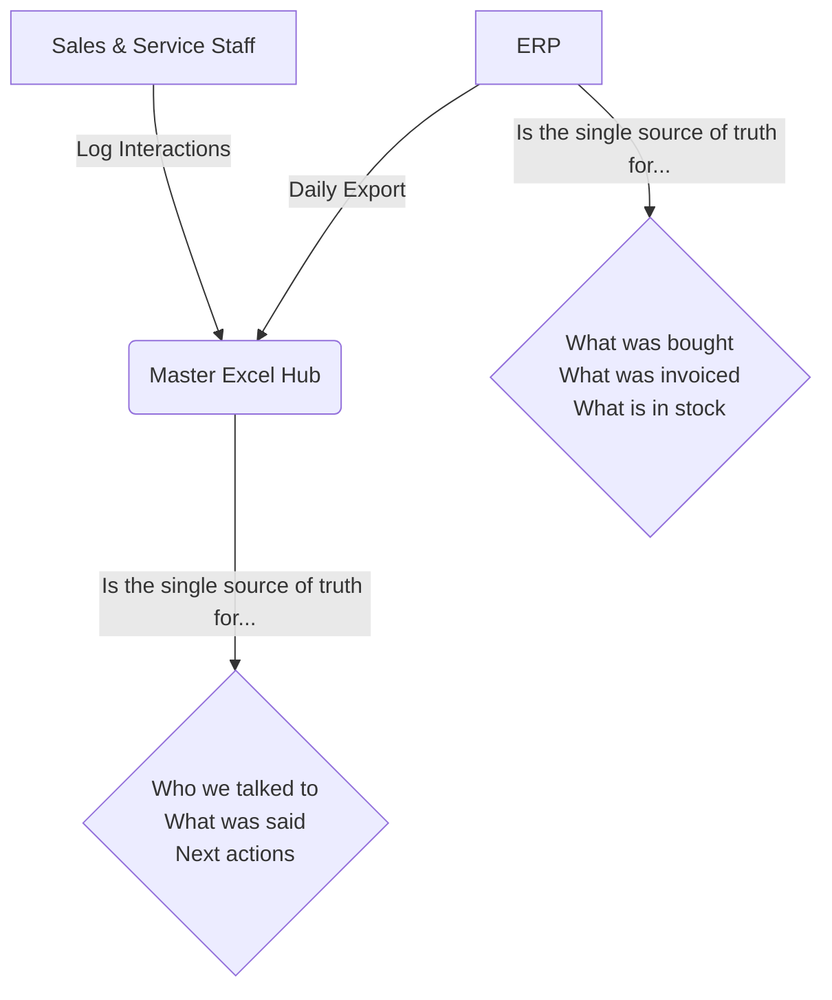

# Unified Customer Experience Strategy v4
## Mikano International Limited

---

## 🔹 Executive Summary

**The Goal**: A single, unified customer experience to boost satisfaction and revenue.

**The Strategy**: This is a ground-up plan focused on what works in reality. We will build a simple, robust foundation using tools we already control. The core principles are:
1.  **ERP is the King**: The ERP is the source of truth for all financial data (invoices, inventory). Our system works with it, not against it.
2.  **System-Driven Rules**: We will use data to solve problems like sales conflicts, not rely on people to "do the right thing."
3.  **Pragmatic Tech**: We use simple, free tools like Excel and Google Analytics correctly. We will not over-engineer solutions.

---

## 🔹 The Core System: Data & Rules

### Data Flow: How Information Moves

The ERP is the master. Our customer hub is a layer on top for interactions.

*   **Source of Truth**: The **ERP** holds all official financial records, inventory, and formal quotations.
*   **The Interaction Hub**: A master **Excel file** on a shared drive. This is our simple CRM.
    *   It holds **copies** of customer data exported from the ERP.
    *   Crucially, it is where we log all **interactions**: phone calls, WhatsApp chats, meeting notes. This is the information the ERP cannot see.
*   **The Flow**:
    1.  **ERP -> EXCEL**: A manager regularly **exports** key data (customer lists, price lists) from ERP to a CSV file.
    2.  **EXCEL UPDATE**: This CSV is used to update the master Excel Customer Hub.
    3.  **MANUAL ENTRY**: Staff add all their interaction notes directly into the Excel Hub.

### Rules of Engagement: Solving Sales Conflicts with Data

This system prevents arguments about "who owns the customer."

*   **On Two Salespeople & One Account**:
    *   It doesn't matter if Salesperson A is talking to Contact A and Salesperson B is talking to Contact B at the same Company.
    *   All interactions are logged in the central Excel Hub under the **Account**.
    *   This provides **shared visibility**. Before contacting anyone at an existing account, a salesperson MUST check the hub to see recent activity.
*   **On Account Ownership**:
    *   **The Rule**: The "Account Owner" is the salesperson who closed the **last deal by monetary value** within the last 12 months.
    *   The Account Owner is responsible for the overall relationship strategy but does not block other salespeople from interacting with contacts.
    *   This is a data-driven rule. There is no debate.
*   **On Invoices vs. Quotations (PFI)**:
    *   This system clarifies the workflow. A formal "Quotation" can be generated from the ERP.
    *   A quick "Proforma Invoice" (PFI) can be noted as an interaction in the Excel Hub, and if the client proceeds, it can then be formalized in the ERP.

### Technology: Using Free Tools The Right Way

*   **PWA De-scoped**: We are **not** building a Progressive Web App (PWA) for now. It is over-engineering. We will focus 100% on perfecting the manual Excel-based process.
*   **Google Analytics Explained**:
    *   **Question**: How does GA track a WhatsApp message?
    *   **Answer**: It doesn't, not directly. It works by **correlation**.
        *   **Example**: You run a Facebook Ad. GA shows you 200 people clicked the ad and visited your website's contact page. That same day, you receive 15 WhatsApp inquiries. You can be confident the ad is working.
    *   **How to improve it for free**: Create specific landing pages. An ad for a Changan CS55 can point to `mikanomotors.com/cs55-offer`. GA can track visits to that specific page, giving you a much clearer signal on which ads are driving which inquiries.

---

## 🔹 Customer Journey Maps (Revised)

### Motors Journey (B2C & Small Business)

*   **1. Awareness & Consideration**
    *   **Touchpoints**: Social media, dealer visits, website, word-of-mouth.
    *   **Goal**: Grab attention by showcasing:
        *   The 6-year warranty.
        *   Positive customer testimonials.
        *   Service quality and expertise.
*   **2. Purchase**
    *   **Touchpoints**: Test drive, sales consultation.
    *   **Note**: Industry benchmarks show this is a critical stage where many potential buyers are lost.
    *   **Solutions**:
        *   **Proactive Follow-up**: All inquiries get a qualified response in under 12 hours.
        *   **Standardised Test Drive**: A consistent, high-quality experience for every test drive.
        *   **Transparent Pricing**: Clear, easy-to-understand quotes with no hidden costs.
*   **3. Onboarding**
    *   **Goal**: A seamless handover that proves we are professional.
    *   **What this means**:
        *   A standard vehicle delivery checklist is used every time.
        *   Warranty documents are sent digitally to the customer (WhatsApp/Email) on the day of delivery.
        *   The first service is booked at the point of delivery, with an automated reminder sent 1 week prior.
*   **4. Usage & Loyalty**
    *   **Goal**: Proactive service and no surprises.
    *   **What this means**:
        *   For any service, a detailed quote must be approved by the customer **before** work begins.
        *   If the final bill will be more than 10% above the quote, it requires manager approval and customer re-confirmation.

### Power & Industrial Journey (B2B)

*   **1. Problem & Research**
    *   **Key Players**: Engineers, Operations Managers, **Real Estate Developers, Project Managers for Banks, Hotels, Airports.**
    *   **Goal**: Become their trusted technical advisor.
*   **2. Evaluation & Comparison**
    *   **Key Players**: Procurement Managers, Finance Directors, CEOs.
    *   **Goal**: Provide clear business value and technical superiority to each stakeholder.
*   **3. Procurement & Delivery**
    *   **Goal**: A smooth, professional process with zero delays.
*   **4. In-Life & Renewal**
    *   **Goal**: Ensure maximum uptime and build the case for service contract renewals.

### Medical Division Journey (B2B2C - Syringes)

*   **1. Distributor Acquisition & Onboarding**
    *   **Touchpoints**: Sales meetings, contract negotiations, logistics planning.
    *   **Goal**: Secure reliable, high-volume distributors in key regions.
*   **2. Distributor Management**
    *   **Touchpoints**: Regular check-ins on stock levels, re-ordering process, payment.
    *   **Goal**: Make it easy and profitable for distributors to sell our products.
*   **3. Downstream Support (Hospitals/Clinics)**
    *   **Touchpoints**: Providing marketing materials, product specification sheets, and training to distributors that they can pass on to hospitals.
    *   **Goal**: Ensure the end-user (hospitals) have the information they need.
*   **4. Quality Feedback Loop**
    *   **Touchpoints**: A clear channel for distributors to report any product issues or feedback from the hospitals.
    *   **Goal**: A fast, effective response to any quality concerns to protect the brand.

### GRAS Restaurant & Cube 65 Clinic Journey (B2C Service)

*   **1. Awareness & Booking**
    *   **Touchpoints**: Instagram, Google Maps, word-of-mouth, walk-ins, phone calls.
    *   **Goal**: Make it easy to discover us and book an appointment or table.
*   **2. Arrival & Welcome**
    *   **Touchpoints**: The front desk/host, waiting area, ambiance.
    *   **Goal**: A warm, professional welcome that sets a positive tone.
*   **3. The Core Experience**
    *   **Touchpoints**: The consultation (clinic) or the meal (restaurant), staff interaction.
    *   **Goal**: A high-quality, expert service that meets the customer's needs.
*   **4. Payment & Departure**
    *   **Touchpoints**: The bill, payment process, farewell.
    *   **Goal**: An efficient, error-free closing to the experience.
*   **5. Loyalty & Return**
    *   **Touchpoints**: Post-visit feedback requests, special offers for repeat customers.
    *   **Goal**: Encourage repeat business and positive reviews.

---

## 🔹 Define & Measure Success (KPIs for All)

### Motors Division
*   Inquiry-to-Quote Rate, Quote-to-Purchase Rate, First-Contact Resolution Rate.

### Power, Construction & Industrial (B2B)
*   Lead-to-Site-Visit Rate, Proposal Win Rate, Average Sales Cycle Length.

### Medical Division
*   **Distributor Order Frequency**: How often do our key distributors re-order?
*   **Average Order Volume**: Is the size of their typical order growing?
*   **Time-to-Resolve Quality Flags**: How quickly do we address issues reported from the field?

### GRAS Restaurant & Cube 65 Clinic
*   **Average Spend Per Customer**.
*   **Repeat Customer Rate**: What percentage of customers this month have visited before?
*   **Online Review Score**: Average rating on Google Maps / other platforms.

---

## 🔹 Clear Next Actions (Revised)

**Weeks 1-2: Setup**
1.  **Create the Master Excel Hub**: Build the spreadsheet with separate tabs for Accounts and Contacts.
2.  **Define ERP Export**: Work with IT to define the standard customer & price list export.
3.  **Review Existing Comms**:
    *   Audit the existing **Motors WhatsApp Business line** (`+234 904 516 3359`). How are messages currently handled?
    *   Map the call flow for the **central triage hotline**.

**Weeks 3-4: Training & Go-Live**
1.  **Team Training**: Train all staff on the Account/Contact model, the Rules of Engagement for ownership, and how to use the Excel Hub.
2.  **Go-Live**: Start using the Excel Hub for all new interactions.
3.  **Schedule First Export**: Run the first manual ERP data export and update the Hub.

**Weeks 5-6: Review & Refine**
1.  **First Performance Review**: Review the Excel Hub data. Are the rules being followed?
2.  **Gather Feedback**: Ask staff what is working and what is not with the new process.
3.  **Plan Landing Pages**: Based on GA data, decide on the first campaign-specific landing page to create. 