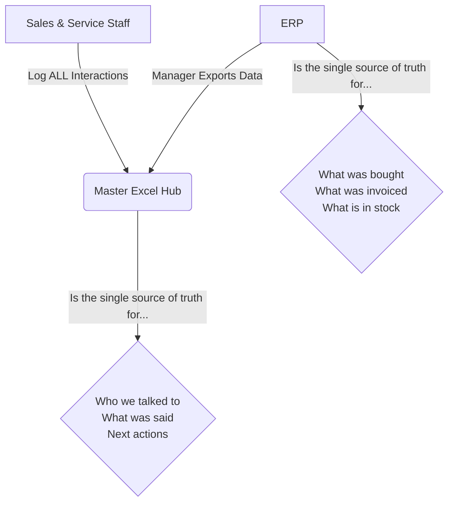

# Unified Customer Experience Strategy v5
## Mikano International Limited

---

## 🔹 Executive Summary

**The Goal**: A single, unified customer experience to boost satisfaction and revenue.

**The Strategy**: This is a ground-up plan focused on what works in reality. We will build a simple, robust foundation using tools we already control. The core principles are:
1.  **ERP is the King**: The ERP is the source of truth for all financial data. Our system works with it, not against it.
2.  **System-Driven Rules**: We will use data to solve problems like sales conflicts, not rely on people to "do the right thing."
3.  **Pragmatic Tech**: We use Excel because it is powerful, flexible, and has no contact limits. We will not over-engineer solutions.

---

## 🔹 The Core System: Data, Structure & Rules

### The Excel Interaction Hub: Proposed Structure

This turns the idea of a "simple CRM" into a concrete tool.

*   **Tab 1: Accounts**
    *   This tab lists the business entities. Each company is one row.
    *   **Columns**: `Account ID` (unique number we create), `Company Name`, `Industry`, `Address`, `Main Phone Number`, `ERP Customer ID`, `Account Owner` (salesperson's name).
*   **Tab 2: Contacts**
    *   This tab lists the people we talk to. Each person is one row.
    *   **Columns**: `Contact ID` (unique number we create), `Full Name`, `Job Title`, `Email`, `Mobile Number`, `Associated Account ID` (links to Tab 1).
*   **Tab 3: Interactions**
    *   This is the most important tab. Every call, major email, WhatsApp chat, or meeting is a new row.
    *   **Columns**: `Interaction ID`, `Date`, `Contact ID` (who we talked to), `Account ID` (who they represent), `Channel` (Phone, WhatsApp, Meeting), `Notes` (what was discussed), `Next Action`, `Action Due Date`, `Logged By` (staff name).

### Data Flow: How Information Moves

The ERP is the master record. Our Excel hub is the interaction log.

### Rules of Engagement: Solving Sales Conflicts with Data

*   **Shared Visibility**: Before contacting anyone at an existing account, a salesperson MUST check the Excel Hub to see recent interactions.
*   **Data-Driven Ownership**: The "Account Owner" is the salesperson who closed the **last deal by monetary value** within the last 12 months. This is calculated from ERP data. The owner leads strategy but does not block interaction.

---

## 🔹 Customer Journey Maps (Revised)

### Motors Journey (B2C & Small Business)

*   **1. Awareness & Consideration**
    *   **Touchpoints**: Social media (Instagram, etc.), dealer visits, website, word-of-mouth.
    *   **Goal**: Grab attention by showcasing our full range of value:
        *   Promotional offers and campaigns.
        *   Vehicle awards and positive reviews.
        *   The 6-year warranty and service quality.
*   **2. Purchase**
    *   **Touchpoints**: Test drive, sales consultation, quote generation.
    *   **Solutions**:
        *   **Proactive Follow-up**: All inquiries get a qualified response in under 12 hours.
        *   **Fast & Clear Quotes**: Provide accurate price quotes quickly.
        *   **Standardised Test Drive**: A consistent, high-quality experience every time.
*   **3. Onboarding**
    *   **Goal**: A seamless handover that proves our professionalism.
    *   **What this means**:
        *   A standard vehicle delivery checklist is used every time.
        *   The first service is booked at the point of delivery, with a reminder sent 1 week prior.
*   **4. Usage & Loyalty**
    *   **Initial Finding**: The key pain point is a lack of transparency on service pricing.
    *   **Solutions**:
        *   A detailed quote must be approved by the customer **before** any service work begins.
        *   If the final bill will be more than 10% above the approved quote, it requires manager approval and customer re-confirmation.

### Power & Industrial Journey (B2B) - *Draft*

*Note: This is a foundational draft. We will refine it using the Open Questions at the end of this document.*
*   **1. Lead Generation (Inbound & Outbound)**
    *   **Inbound**: Brand reputation drives inquiries via website, calls, and referrals.
    *   **Outbound**: Proactive outreach to target sectors (real estate developers, banks, hotels).
    *   **Goal**: Capture all leads in the Excel Hub and route them to the correct specialist within 4 hours.
*   **2. Technical Qualification & Consultation**
    *   **Goal**: Understand the client's technical requirements and business needs deeply.
*   **3. Proposal & Negotiation**
    *   **Goal**: Deliver a clear proposal that proves our value over competitors.
*   **4. Project Delivery & In-Life Support**
    *   **Goal**: Flawless execution and proactive support to ensure maximum uptime.

### Medical Division Journey (B2B2C - Syringes) - *Draft*

*Note: This is a foundational draft. We will refine it using the Open Questions at the end of this document.*
*   **1. Market Analysis & Target Identification**
    *   **Goal**: Identify and prioritize potential high-volume distributors in key geographical regions.
*   **2. Acquisition & Onboarding**
    *   **Goal**: Secure reliable distribution partners and provide them with all necessary product and sales training.
*   **3. Distributor Management & Growth**
    *   **Goal**: Make it easy and profitable for distributors to order from us and grow their volume.
*   **4. Downstream Support & Quality Feedback**
    *   **Goal**: Provide materials for distributors to give to hospitals and establish a fast, effective channel for any quality feedback from the field.

---

## 🔹 Define & Measure Success (KPIs for All)

### Motors Division
*   **Top of Funnel**: # of qualified inquiries per week/month.
*   **Sales Conversion**: Inquiry-to-Quote Rate (Target >60%), Quote-to-Purchase Rate (Target >40%).
*   **After-Sales**: First-Contact Resolution Rate (Target >80%), Service Contract Renewal Rate.

### Power, Construction & Industrial (B2B)
*   Lead-to-Site-Visit Rate, Proposal Win Rate, Average Sales Cycle Length.

### Medical Division
*   Distributor Order Frequency, Average Order Volume, Time-to-Resolve Quality Flags.

### GRAS Restaurant & Cube 65 Clinic
*   Average Spend Per Customer, Repeat Customer Rate, Online Review Score.

---

## 🔹 Phased Action Plan

### Phase 1: Foundation Setup (Weeks 1-4)

*   **Task 1: Finalise & Build the Excel Hub**
    *   Sub-Task 1.1: Circulate the proposed structure (from this doc) with key sales managers for feedback. [Complexity: 2/10]
    *   Sub-Task 1.2: Make any final adjustments to the column structure. [Complexity: 1/10]
    *   Sub-Task 1.3: Create the final, blank Excel file and save it to a shared, access-controlled drive. [Complexity: 1/10]
*   **Task 2: Define Data Processes**
    *   Sub-Task 2.1: Meet with **Divisional Management** to define the standard customer & price list export from the ERP. [Complexity: 3/10]
    *   Sub-Task 2.2: Document the step-by-step process for a manager to export this data. [Complexity: 2/10]
    *   Sub-Task 2.3: Integrate findings from the **ongoing communications audit** into the "Channel" and "Notes" fields of the Interaction Hub. [Complexity: 3/10]
*   **Task 3: Team Training**
    *   Sub-Task 3.1: Create a simple, 1-page guide on how to use the Excel Hub. [Complexity: 2/10]
    *   Sub-Task 3.2: Schedule and run a training session with all customer-facing staff. [Complexity: 3/10]

### Phase 2: Implementation & Refinement (Weeks 5-8)

*   **Task 4: Go-Live**
    *   Sub-Task 4.1: Announce the official "Go-Live" date for using the Excel Hub for all new interactions. [Complexity: 1/10]
    *   Sub-Task 4.2: Run the first weekly ERP data export and update the hub. [Complexity: 2/10]
*   **Task 5: Review & Support**
    *   Sub-Task 5.1: Schedule a weekly 30-minute meeting to review the hub's data and usage. [Complexity: 2/10]
    *   Sub-Task 5.2: Gather direct feedback from staff: What's working? What's clumsy? [Complexity: 2/10]
    *   Sub-Task 5.3: Make iterative improvements to the Excel Hub based on feedback. [Complexity: 3/10]

---

## 🔹 Open Questions for Journey Refinement

This is where we acknowledge what we don't know yet. The answers to these questions will help us refine the draft journeys for Power and Medical.

### For Power & Industrial
1.  When an inbound lead comes in, what are the exact steps to determine if it's "qualified"?
2.  What does a "technical consultation" actually involve? Is it a site visit, a call, a document review?
3.  What is the single biggest reason we lose deals after submitting a proposal? Is it price, features, or something else?

### For Medical
1.  How do we currently find potential distributors? Word of mouth? Industry lists?
2.  What is the most important thing a distributor needs from us to be successful (besides the product itself)? Is it marketing support, preferential pricing, fast delivery?
3.  What does the "onboarding" process for a new distributor look like today? What are the steps? 