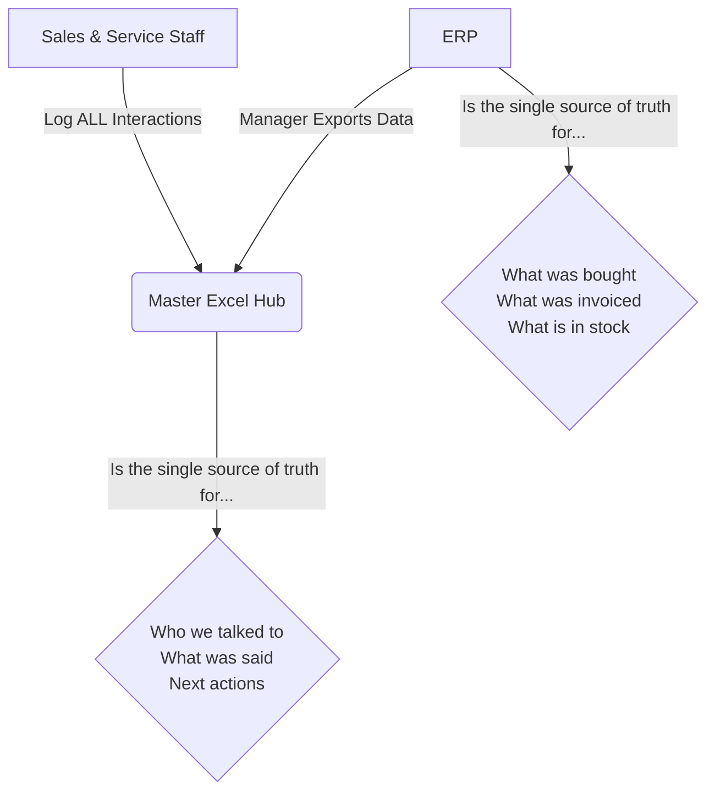
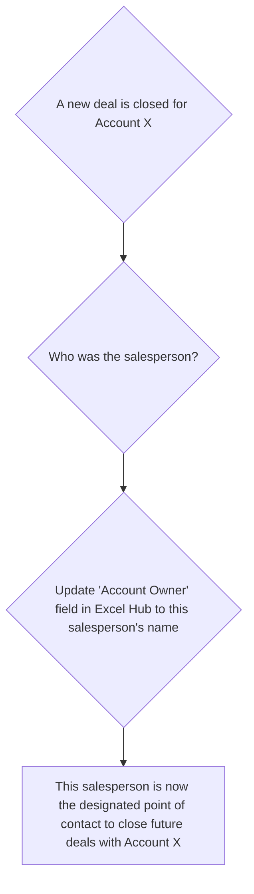

# Unified Customer Experience Strategy v8
## Mikano International Limited

---

## 🔹 Executive Summary

**The Goal**: A single, unified customer experience to boost satisfaction and revenue.

**The Strategy**: This is a ground-up plan focused on what works in reality. We will build a simple, robust foundation using tools we already control. The core principles are:
1.  **ERP is the King**: The ERP is the source of truth for all financial data. Our system works with it, not against it.
2.  **System-Driven Rules**: We will use data to solve problems like sales conflicts, not rely on people to "do the right thing."
3.  **Pragmatic Tech**: We use Excel because it is powerful, flexible, and has no contact limits.

---

## 🔹 Critical Success Factors & Risk Mitigation

### Risk 1: Poor User Adoption
*   **The Problem**: Busy staff see this as "extra work" and don't log their interactions consistently.
*   **The "What's In It For Me?" (WIIFM) for Staff**:
    *   **For Sales**: "Ensure your hard work is visible. If your activity is logged in the Hub, it's undeniable proof of your work towards a commission."
    *   **For Service**: "Access a customer's full history instantly so you never look unprepared or unprofessional. You can see what we know, what's been promised, and what's been done."
    *   **For Management**: "Get a clear, weekly view of pipeline and team activity to make better decisions, without chasing people for updates."
*   **Mitigation**: Adoption cannot be optional. The Excel Hub must become the **standard operating procedure** for weekly sales and service reviews.
    *   All sales pipeline reviews will be conducted directly from a pivot table summary of the Excel Hub. If a deal isn't in the hub, it's not in the official pipeline.
    *   Service managers will review 'Time to Resolution' for customer issues using data logged in the Interactions tab.
    *   Salesperson activity metrics (e.g., # of meetings, calls logged) will be pulled directly from the 'Logged By' column for performance conversations.

### Risk 2: Data Quality ("Garbage In, Garbage Out")
*   **Mitigation: Basic Data Governance**:
    *   **Rule 1: Always Search First**: Before creating a new Account or Contact, you must search to see if it already exists.
    *   **Rule 2: Standard Naming**: Company names must be entered exactly as they appear on official documents.
    *   **Rule 3: Assign a Data Steward**: One person per division must be assigned the role of "Data Steward," responsible for periodically cleaning the data.

### Risk 3: Hidden Complexity & Politics
*   **Mitigation: Address Key Issues Upfront**:
    *   **Cross-Divisional Compensation**: Management must define the **compensation model for cross-selling** before this project goes live. If a Motors salesperson passes a lead to Power that closes, what is their incentive? Clarity here is essential for collaboration.

### Risk 4: Scalability
*   **Mitigation: Define a Clear Trigger for Upgrading**:
    *   We will re-evaluate the Excel solution and begin a formal CRM project when any two of the following are true: the file size exceeds 100MB, the file takes more than 10 seconds to open, Data Stewards spend more than 2 hours per week cleaning data, or we have more than 25 concurrent users.

---

## 🔹 The Core System: Data, Structure & Rules

### The Excel Interaction Hub: Structure

| Tab Name      | Purpose                                           | Key Columns                                                                                                                         |
| :------------ | :------------------------------------------------ | :---------------------------------------------------------------------------------------------------------------------------------- |
| **Accounts**  | Lists the business entities. One company per row. | `Account ID`, `Company Name`, `Industry`, `Address`, `Main Phone Number`, `ERP Customer ID`, `Account Owner`                                |
| **Contacts**  | Lists the people we talk to. One person per row.  | `Contact ID`, `Full Name`, `Job Title`, `Email`, `Mobile Number`, `Associated Account ID` (links to Accounts tab)                          |
| **Interactions**| Logs every meaningful interaction. One row per interaction. | `Interaction ID`, `Date`, `Contact ID`, `Account ID`, `Channel` (Phone, WhatsApp, Meeting), `Notes`, `Next Action`, `Action Due Date`, `Logged By` |

### Data Flow: How Information Moves

The ERP is the master record. Our Excel hub is the interaction log.

### Rules of Engagement: Solving Sales Conflicts with Data

This system prevents arguments about "who owns the customer." The rule is based on data, not opinion.

---

## 🔹 Customer Journey Maps

### Motors Journey (B2C & Small Business)
*   **1. Awareness & Consideration**
    *   **Touchpoints**: Social media (Instagram, etc.), dealer visits, website, word-of-mouth.
    *   **Goal**: Grab attention by showcasing our full range of value:
        *   Promotional offers and campaigns.
        *   Vehicle awards and positive reviews.
        *   The 6-year warranty and service quality.
*   **2. Purchase**
    *   **Touchpoints**: Test drive, sales consultation, quote generation.
    *   **Solutions**:
        *   **Proactive Follow-up**: All inquiries get a qualified response in under 12 hours.
        *   **Fast & Clear Quotes**: Provide accurate price quotes quickly.
        *   **Standardised Test Drive**: A consistent, high-quality experience every time.
*   **3. Onboarding**
    *   **Goal**: A seamless handover that proves our professionalism.
    *   **What this means**:
        *   A standard vehicle delivery checklist is used every time.
        *   The first service is booked at the point of delivery, with a reminder sent 1 week prior.
*   **4. Usage & Loyalty**
    *   **Initial Finding**: The key pain point is a lack of transparency on service pricing.
    *   **Solutions**:
        *   A detailed quote must be approved by the customer **before** any service work begins.
        *   If the final bill will be more than 10% above the approved quote, it requires manager approval and customer re-confirmation.

### Power & Industrial Journey (B2B) - *Draft*
*Note: This is a foundational draft. We will refine it using the Open Questions at the end of this document.*
*   **1. Lead Generation (Inbound & Outbound)**
    *   **Inbound**: Brand reputation drives inquiries via website, calls, and referrals.
    *   **Outbound**: Proactive outreach to target sectors (real estate developers, banks, hotels).
    *   **Goal**: Capture all leads in the Excel Hub and route them to the correct specialist within 4 hours.
*   **2. Technical Qualification & Consultation**
    *   **Goal**: Understand the client's technical requirements and business needs deeply.
*   **3. Proposal & Negotiation**
    *   **Goal**: Deliver a clear proposal that proves our value over competitors.
*   **4. Project Delivery & In-Life Support**
    *   **Goal**: Flawless execution and proactive support to ensure maximum uptime.

### Medical Division Journey (B2B2C - Syringes) - *Draft*
*Note: This is a foundational draft. We will refine it using the Open Questions at the end of this document.*
*   **1. Market Analysis & Target Identification**
    *   **Goal**: Identify and prioritize potential high-volume distributors in key geographical regions.
*   **2. Acquisition & Onboarding**
    *   **Goal**: Secure reliable distribution partners and provide them with all necessary product and sales training.
*   **3. Distributor Management & Growth**
    *   **Goal**: Make it easy and profitable for distributors to order from us and grow their volume.
*   **4. Downstream Support & Quality Feedback**
    *   **Goal**: Provide materials for distributors to give to hospitals and establish a fast, effective channel for any quality feedback from the field.

---

## 🔹 Define & Measure Success (KPIs)

### Motors Division
*   **Top of Funnel**: # of qualified inquiries per week/month.
*   **Sales Conversion**: Inquiry-to-Quote Rate (Target >60%), Quote-to-Purchase Rate (Target >40%).
*   **After-Sales**: First-Contact Resolution Rate (Target >80%), Service Contract Renewal Rate.

### Power, Construction & Industrial (B2B)
*   Lead-to-Site-Visit Rate, Proposal Win Rate, Average Sales Cycle Length.

### Medical Division
*   Distributor Order Frequency, Average Order Volume, Time-to-Resolve Quality Flags.

### GRAS Restaurant & Cube 65 Clinic
*   Average Spend Per Customer, Repeat Customer Rate, Online Review Score.

---

## 🔹 Phased Action Plan

### Phase 0: Discovery & Alignment (Weeks 1-2)
*This is the most critical phase. We do not build anything until we have answers.*
*   **Task 1: Stakeholder Alignment on this Initiative**
    *   Hold a kickoff meeting with key stakeholders (Data Team, Divisional Heads) to present this document.
    *   Use the "Open Questions" section below as an agenda to gather initial requirements and identify unknowns.
    *   Get formal buy-in from management to proceed with the plan.

### Phase 1: Foundation Setup (Weeks 3-6)
*   **Task 2: Finalise & Build the Excel Hub**
    *   Based on feedback from Phase 0, make final adjustments to the Excel Hub structure.
    *   Create the final, blank Excel file and save it to a shared, access-controlled drive.
*   **Task 3: Define Data & Governance Roles**
    *   Meet with Divisional Management to **define and assign the role** responsible for the recurring ERP data export.
    *   Document the export process.
    *   **Assign one "Data Steward"** per division responsible for data quality.
*   **Task 4: Team Training**
    *   Create a simple, 1-page guide on how to use the Excel Hub and the importance of data quality.
    *   Schedule and run a training session with all customer-facing staff.

### Phase 2: Go-Live & First Review Cycle (Weeks 7-8)
*   **Task 5: Announce & Execute Go-Live**
    *   Communicate the official "Go-Live" date to all staff.
    *   Begin logging all new interactions in the Excel Hub from this date forward.
*   **Task 6: Initial Data Synchronisation**
    *   Perform the first full ERP data export and populate the Accounts tab.
    *   Manually add any key existing contacts to the Contacts tab.
*   **Task 7: Conduct First Weekly Review**
    *   Hold the first weekly review meeting using the data from the Excel Hub.
    *   Use this as a practical opportunity to test the process and reinforce the new standard.

### Phase 3: Embed & Refine (Weeks 9-12)
*   **Task 8: Establish Regular Cadence**
    *   Continue the process of regular ERP exports and daily interaction logging.
    *   Continue the weekly review meetings, focusing on KPIs and data quality.
*   **Task 9: Gather Feedback & Iterate**
    *   After the first month of use, hold a dedicated feedback session with staff.
    *   Make iterative improvements to the Excel Hub based on this feedback.

---

## 🔹 Open Questions for Discovery Phase

### Overall Strategy & Governance
1.  Which divisions are officially in-scope for Phase 1 of this project?
2.  If the answer is "all at once," what are the priority metrics for each, and what additional resources can be committed to support this wider scope?
3.  What is the single most important outcome management wants to see from this in the first 3 months?
4.  What is the policy for cross-divisional sales compensation?

### For the Data & ERP Team
1.  What are the unique identifiers for customers in the ERP? Can we use this as the `ERP Customer ID`?
2.  Is it possible to export customer records based on "last modified date" to avoid exporting the entire database each time?
3.  How frequently can we realistically run these exports without impacting system performance?

### For Sales & Marketing (Cross-Divisional)
1.  What is the current process for handing off a lead from an inbound call to a salesperson?
2.  How is "Account Ownership" currently decided? How are disputes resolved today?
3.  What are the most common reasons a customer gives for not buying after receiving a quote?

### For Motors Division
1.  Besides price, what is the biggest reason a customer chooses a competitor over us?
2.  What is one piece of information that would make the vehicle handover process smoother?

### For Power & Industrial Division
1.  What are the exact steps to determine if an inbound lead is "qualified"?
2.  What does a "technical consultation" actually involve? A site visit, a call, a document review?
3.  What is the single biggest reason we lose deals after submitting a proposal?

### For Medical Division
1.  How do we currently find potential distributors?
2.  What is the most important thing a distributor needs from us to be successful (besides the product)?
3.  What does the "onboarding" process for a new distributor look like today? 