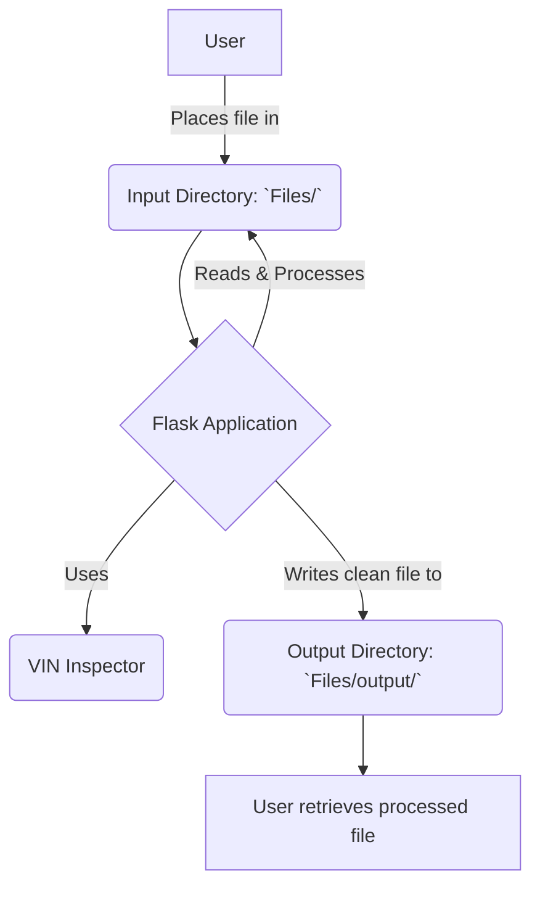

# 3. Architecture

This tool is composed of several key components that work together to process data.

## Visual Workflow

### Core Components

*   **Flask Application (`operations-flask-app/`)**
    *   **What it is:** The central engine of the tool, built using the Python web framework, Flask.
    *   **Function:** It contains the primary logic for reading files, applying data cleaning and transformation rules, and writing the processed files to the output directory. It provides the main entry point (`app.py`) for running the tool.

*   **VIN Inspector (`source files/VinInspector 2/`)**
    *   **What it is:** A specialized utility designed specifically for the Mikano Motors automotive business.
    *   **Function:** Its primary role is likely to validate and inspect Vehicle Identification Numbers (VINs) found within the source data, ensuring data accuracy for vehicle-related records.

*   **Input Data Directory (`operations-flask-app/Files/`)**
    *   **What it is:** The designated "inbox" for the tool.
    *   **Function:** Users place all raw data files (spreadsheets, CSVs) that need to be processed into this folder.

*   **Output Data Directory (`operations-flask-app/Files/output/`)**
    *   **What it is:** The designated "outbox" for the tool.
    *   **Function:** After the application has run, the cleaned, standardized, and processed files are saved here.
